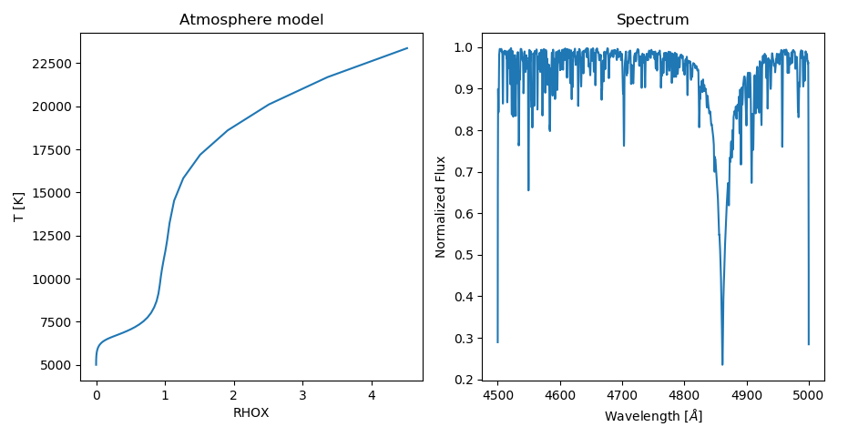

# VidmaPy - wrapper for Kurucz's ATLAS/SYNTHE codes

VidmaPy is a python module that enable user to use the power of ATLAS/SYNTHE codes with just few lines of python code.

## Key features
* Easy access to ATLAS and SYNTHE codes through Python

### Example code
```python
from vidmapy.kurucz.atlas import Atlas
from vidmapy.kurucz.synthe import Synthe
from vidmapy.kurucz.parameters import Parameters
import matplotlib.pyplot as plt

atlas_worker = Atlas()
model = atlas_worker.get_model(Parameters(teff=8000., logg=4.0, metallicity=0.0, microturbulence=2.0))

synthe_worker = Synthe()
spectrum = synthe_worker.get_spectrum(model, Parameters(wave_min=4500., wave_max=5000., vsini=50.))

# Plot results
f, (ax1, ax2) = plt.subplots(1, 2)
ax1.plot(model.structure["RHOX"],model.structure["T"])
ax1.set_title('Atmosphere model')
ax1.set_xlabel("RHOX")
ax1.set_ylabel("T [K]")

ax2.plot(spectrum.wave, spectrum.normed_flux)
ax2.set_title('Spectrum')
ax2.set_xlabel("Wavelength [$\AA$]")
ax2.set_ylabel("Normalized Flux")

plt.show()
```


## Getting Started

### Prerequisites

* Python3
* Conda - usefull but not necessary

### Download

Two steps:
* Clone the repository or download it as the .zip file:
  - Clone by:
    ```
    git clone https://github.com/RozanskiT/vidmapy.git
    ```
  - Download zip from:
  [vidmapy-master.zip](https://github.com/RozanskiT/vidmapy/archive/master.zip)
* Download and untar direcotires with necessary atomic data in /vidmapy/kurucz/atomic_data/
  - Can be downloaded from : [atomc data](https://drive.google.com/drive/folders/1H-lFH69fyWvwWydgO8uBS3TIAdZ9hWdc?usp=sharing)
  
## Tutorial
TODO: fulfill

## License

This project is licensed under the MIT License - see the [LICENSE](LICENSE) file for details

## Acknowledgments

* Ewa Niemczura
